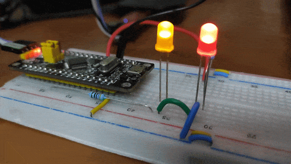

# Working with RTOS on STM32F1
## Introduction
Performing several types of tasks on RTOS on STM32F103C8T6.

## Contents
```
|_ cmsisv2-intro
|_ serial_monitor
```

1. [CMSIS RTOS V2](./cmsisv2-intro/): STM32 supports CMSIS V2. RTOS is used. Two LEDs connected to Pin B12 and Pin A1 respectively, are controlled from two different threads of RTOS.


<br>*[Two RTOS tasks which runs concurrently]*

2. [UART with RTOS](./serial_monitor/): Using UART on RTOS. This project is under development.

<hr>

# Other experiments:

Also checkout my other works with STM32F1: [STM32F103 UART](https://github.com/anindyamitra15/stm32-uart), [STM32F1 GPIO Alternate Functions](https://github.com/anindyamitra15/stm32-gpio-modes) and, [STM32F1 PWM Modes](https://github.com/anindyamitra15/stm32-pwm)
